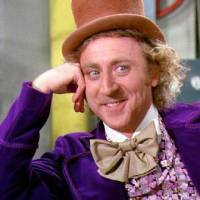

# JPEG Binary Payload

Experiments embedding binary payloads into JPEG images

## Example

The Great Wave image is a JPEG that displays normally, but it contains a payload (another jpeg) that can be extracted from it.

* Original image: 29.45 KB
* Image with payload: 37.20 KB 
* Extracted payload: 7.75 KB 

Original Image:

Extracted Payload:

## Theory of Operation
* JPEG files terminate with `FF D9`
* Binary content that comes later is ignored
* JPEGs can be extended with binary payloads using console commands alone
* Modified JPEGs display typically in browsers and OS windows

## Limitations
* The payload will get dropped if the JPEG is recompressed